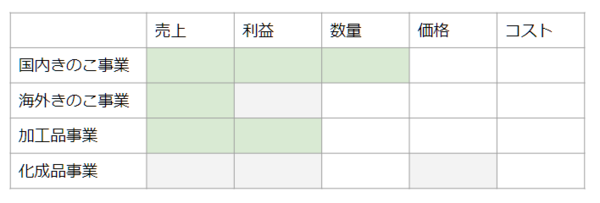
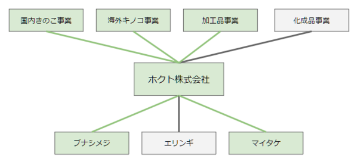
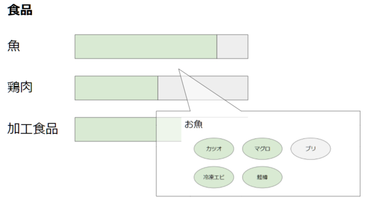

# chABSA-dataset

We developed a Aspect-Based Sentiment Analysis dataset, named chABSA dataset. chABSA website is   

*url*

The annotation target is "overview of business result" of each companies. Specifically, the `OverviewOfBusinessResultsTextBlock` part in the Japanese annual reports. Japanese annual reports are published on [EDINET](http://disclosure.edinet-fsa.go.jp/), and its definitions of format are available on the [Financial Service Agency](http://www.fsa.go.jp/search/index.html) (it's called "タクソノミ").

Now, the examples of the annotation is like following.


You can see the dataset view at the official page.

*url*







## Announcements

comming soon!

## Download the data

comming soon!

## Data organization

### Annotation Format

Annotation result is provided by json file.

(under constructing)

```json
{
  "annotations": [
    {
      "target_id": "5",
      "target": "なお、当連結会計年度の生産量は、ブナピーを含めブナシメジ42,602ｔ（同5.5％増）、エリンギ19,250ｔ（同0.2％減）、マイタケ14,281ｔ（同4.3％増）となりました",
      "label": "product#amount,positive",
      "label_target": "ブナシメジ",
      "position": [
        23,
        28
      ],
      "annotator": "icoxfog417"
    }
  ]
}
```
