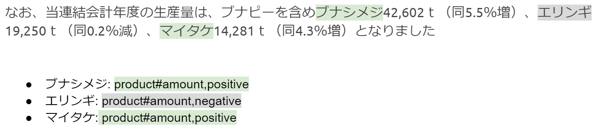

# chABSA-dataset

We developed a Aspect-Based Sentiment Analysis dataset, named chABSA dataset. 




The annotation target is "overview of business result" of each companies. Specifically, the `OverviewOfBusinessResultsTextBlock` part in the Japanese annual reports. Japanese annual reports are published on [EDINET](http://disclosure.edinet-fsa.go.jp/), and its definitions of format are available on the [Financial Service Agency](http://www.fsa.go.jp/search/index.html) (it's called "タクソノミ").

 The `Entity` and `Attribute` pair is like following.

 |          | general            | sales              | profit             | amount             | price           | cost               |
|----------|--------------------|--------------------|--------------------|--------------------|--------------------|--------------------|
| market   | :heavy_check_mark: |                    |                    |                    |                    |                    |
| company  | :heavy_check_mark: | :heavy_check_mark: | :heavy_check_mark: | :heavy_check_mark: | :heavy_check_mark: | :heavy_check_mark: |
| business | :heavy_check_mark: | :heavy_check_mark: | :heavy_check_mark: | :heavy_check_mark: | :heavy_check_mark: | :heavy_check_mark: |
| product  | :heavy_check_mark: | :heavy_check_mark: | :heavy_check_mark: | :heavy_check_mark: | :heavy_check_mark: | :heavy_check_mark: |
| NULL     | :heavy_check_mark: | :heavy_check_mark: | :heavy_check_mark: | :heavy_check_mark: | :heavy_check_mark: | :heavy_check_mark: |
| OOD      | :heavy_check_mark: |                    |                    |                    |                    |                    |

To see the detail definition, please refer [annotation guideline](https://github.com/chakki-works/chABSA-dataset/tree/master/annotation/doc).

## Download the data

[Download Link](https://s3-ap-northeast-1.amazonaws.com/dev.tech-sketch.jp/chakki/public/chABSA-dataset.zip)

The 230 / 2,260 companies are annotated (10% of all company).  
The annotation target companies are selected from each category. Please refer the detail from here.

[Annotation Target](https://docs.google.com/spreadsheets/d/1i1y1Z5TwnKBOJ8fFLZ0D3p6dAG1zxYBRbUXumn0q10M/edit#gid=0)

[Paper](https://github.com/chakki-works/chABSA-dataset/blob/master/doc/chabsa-aspect-based.pdf)


## Jupyter Notebooks

[You can try these on Kaggle Kernel!](https://www.kaggle.com/takahirokubo0/chabsa)

* [Dataset Statistics](https://github.com/chakki-works/chABSA-dataset/blob/master/notebooks/Dataset%20Statistics.ipynb)
* [Baseline for Slot1 Task](https://github.com/chakki-works/chABSA-dataset/blob/master/notebooks/Baseline%20for%20Slot1.ipynb)
* [Baseline for Slot2 Task](https://github.com/chakki-works/chABSA-dataset/blob/master/notebooks/Baseline%20for%20Slot2.ipynb)
* [Baseline for Slot3 Task](https://github.com/chakki-works/chABSA-dataset/blob/master/notebooks/Baseline%20for%20Slot3.ipynb)

## Data organization

### Annotation Format

[Annotation Tools is available here](https://github.com/chakki-works/chABSA-dataset/tree/master/annotation)

Annotation result is provided by json file.

(under constructing)

```json
{
  "header": {
    "document_id": "E00008",
    "document_name": "ホクト株式会社",
    "doc_text": "有価証券報告書",
    "edi_id": "E00008",
    "security_code": "13790",
    "category33": "水産・農林業",
    "category17": "食品",
    "scale": "6"
  },
  "sentences": [
    {
      "sentence_id": 0,
      "sentence": "当連結会計年度におけるわが国経済は、政府の経済政策や日銀の金融緩和策により、企業業績、雇用・所得環境は改善し...",
      "opinions": [
        {
          "target": "わが国経済",
          "category": "NULL#general",
          "polarity": "neutral",
          "from": 11,
          "to": 16
        },
        {
          "target": "企業業績",
          "category": "NULL#general",
          "polarity": "positive",
          "from": 38,
          "to": 42
        },...
      ],
    },
    {
      "sentence_id": 1,
      "sentence": "当社グループを取り巻く環境は、実質賃金が伸び悩むなか、消費者の皆様の...",
      "opinions": [
        {
          "target": "実質賃金",
          "category": "NULL#general",
          "polarity": "negative",
          "from": 15,
          "to": 19
        },...
      ]
    },...
  ]
}
```

| Parameter     | Type | Description                  |
|---------------|------|------------------------------|
| header   | obj  | アノテーション対象文書のヘッダー情報 |
| **sentences** | array[obj]  | 文書内の各文に行われたアノテーション結果 |

### header

| Parameter     | Type | Description                  |
|---------------|------|------------------------------|
| document_id   | str  | 一意の文書id(edi_idと等しい) |
| document_name | str  | 文書名(=企業名)              |
| doc_text      | str  | 文書種別名                   |
| edi_id        | str  | 企業のEDINETコード           |
| security_code | str  | 企業の証券コード             |
| category33    | str  | 企業の33業種区分             |
| category17    | str  | 企業の17業種区分             |
| scale         | str  | 企業の規模区分               |

### sentences

| Parameter   | Type       | Description                      |
|-------------|------------|----------------------------------|
| sentence_id | int        | 文書内の各文に振られた文id       |
| sentence    | str        | アノテーション対象の文           |
| **opinions**    | array[obj] | アノテーションの配列             |
| target      | str        | polarityの対象となっているEntity |
| category    | str        | Entity#Attributeのラベル         |
| polarity    | str        | polarityのラベル                 |
| from        | int        | targetの開始位置                 |
| to          | int        | targetの終了位置                 |

## License

[Creative Commons Attribution 4.0 License.](https://creativecommons.org/licenses/by/4.0/legalcode)
