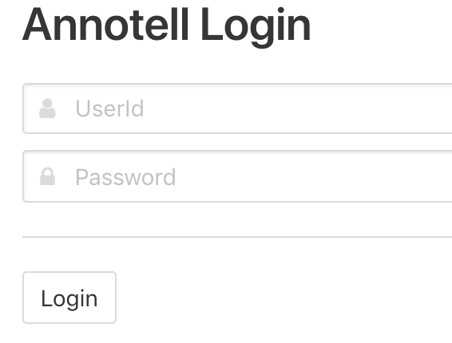
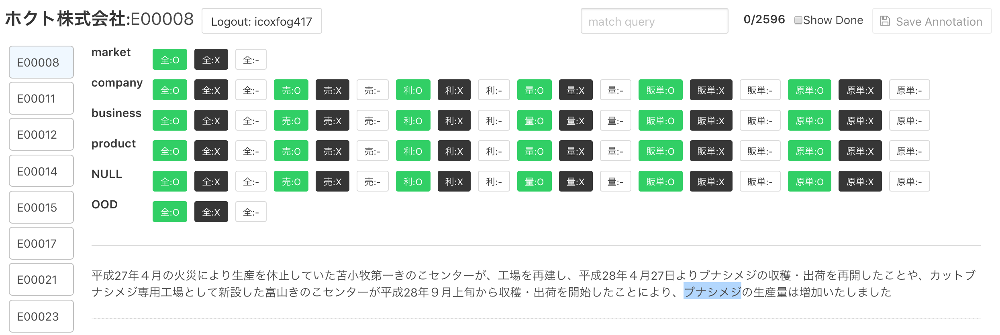

# How to Annotate

## Prepare the data

Execute the scripts in following order.

1. `python annotation/data_processor/download.py`
   * download the `xbrl` files.
2. `python annotation/data_processor/expand.py`
   * expand downloaded archive file.
3. `python annotation/data_processor/extract_tag.py`
   * extract `OverviewOfBusinessResultsTextBlock` from xbrl file.
   * (You can use this script to extract another text block)
4. `python annotation/data_processor/extract_business_result.py`
   * format `OverviewOfBusinessResultsTextBlock` text to json file

All the scripts are executed, the target data is stored at `data/interim`.

## Annotation

You can run annotation tool by executing following script.

`python annotation/run_server.py`

The server runs on http://0.0.0.0:8080/.  

The login id is any unique id to distinguish your annotations from others.
The default password is `__YOUR__SECRET_KEY__`. It is shared to all annotators (so this likes shared link system), and you can set this password by `SECRET_KEY` environmental varibale.

How to use annotation tool is very simple, select entity text and click the 
appropriate button.

**[The annotation guideline is here.](./doc/README.md)**

Short cuts

* `Ctrl + S`: Save
* `Ctrl + Shift + up / down`: Change document (The document is automatically saved when switch the document).

The annotation results are stored at `data/annotated`

## After annotation

You can merge annotations by following script.

`python annotation/data_processor/merge_annotated.py`

The merged result are stored at `data/processed`.
